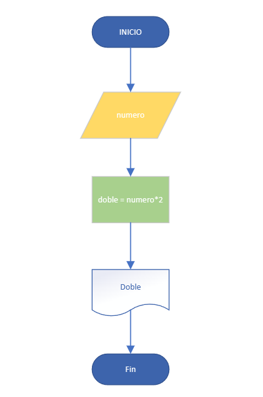
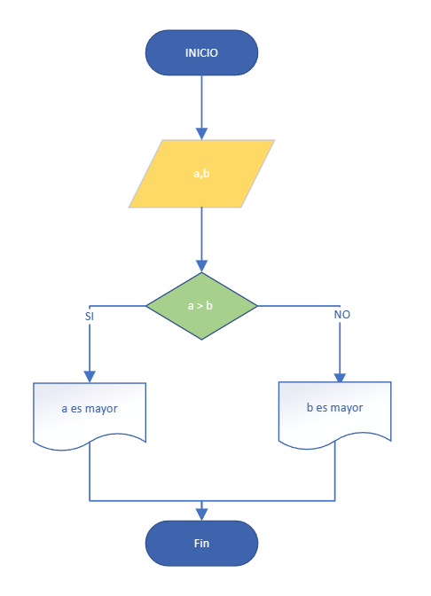
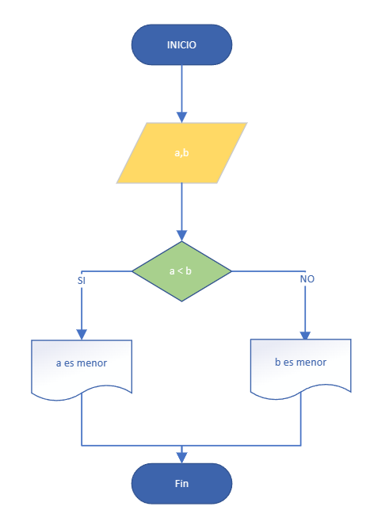

# ALGORITMOS

## Realizar un algoritmo que sume dos números


```
Inicio   
    Leer numero
    Hacer doble = numero * 2
    Escribir doble
Fin
```
---
## Realizar un algoritmo que permita leer dos valores distintos, determinor cuál de los dos valores es el mayor y escribirlo

```
Inicio
    Leer a,b
    Si(a > b) entonces
        Escribir a "es mayor"
    Sino
        Escribir b "es mayor"
    FinSi
Fin

```
## Realizar un algoritmo que permita leer dos valores distintos, determinar cuál de los dos valores es el menor y escribirlo.


```
Inicio
    Leer a,b
    Si(a < b) entonces
        Escribir a "es menor"
    Sino
        Escribir b "es menor"
    FinSi
Fin
```